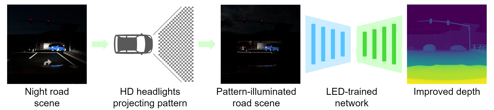

# LED : Light Enhanced Depth Estimation at Night

Official implementation of the method LED and code for the Nighttime Synthetic Drive Dataset.



If you use our dataset in your research, please consider citing:
```
TO BE ADDED (ANONYMIZED)
```
## Dataset
The code is meant to be used with the Nighttime Synthetic Drive Dataset.

The dataset is available at : TO BE ADDED

## Install
1. Clone the repository
    ```
    git clone https://github.com/ANONYMIZED/LED.git
    ```

2. Install Python 3.11 and pip:
    ```
    conda create -n LED python=3.11 pip
    conda activate LED
    ```

3. Install the required dependencies:
    ```
    pip install -r requirements.txt
    ```

## Training
To train the a model, use the `train.py` script. 
Here's how to use it:
```
python train.py [dataset_root] [LED/HB]
```
## Testing
To test a model, use the `test.py` script. 
Here's how to use it:
```
python test.py [dataset_root] [LED/HB] [experience_name]
```
## License 
Code is released under the Apache 2.0 license. 

Dataset is released under TO BE ADDED (ANONYMIZED)
