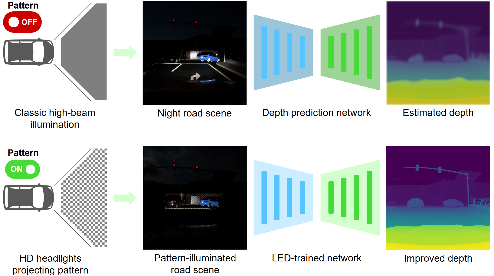

# LED : Light Enhanced Depth Estimation at Night


[Arxiv](https://arxiv.org/abs/2409.08031) | [Project Page](https://simondemoreau.github.io/LED/)

[](https://arxiv.org/abs/2409.08031)
[](https://bmvc2025.bmva.org/)
[](https://simondemoreau.github.io/LED/)




Official implementation of the encoder-decoder in LED. Code, information and download link for the Nighttime Synthetic Drive Dataset.

If you use our dataset in your research, please consider citing:
```bibtex
@inproceedings{deMoreau2024led,
author    = {Simon de Moreau and Yasser Almehio and Andrei Bursuc and Hafid EL IDRISSI and Bogdan Stanciulescu and Fabien Moutarde},
title     = {LED: Light Enhanced Depth Estimation at Night},
booktitle = {BMVC},
year      = {2025},
}
```
## Dataset
The code is meant to be used with the Nighttime Synthetic Drive Dataset. Please see the [project page](https://simondemoreau.github.io/LED/) to download the dataset.

Full dataset size is 483Go, to facilitate download, it has been splitted in multiple zip files, separated between Pattern-illuminated and High Beam part of the dataset, each subset (train/val/test), and each type of annotation (object detection, depth, semantic segmentation...). 

### File structure
If all zips are downloaded and extracted the directories should have this format : 

```
Nighttime Synthetic Drive Dataset/
├── HB
│   ├── test
│   │   └── wuppertal
│   │       └── ...
│   ├── train
│   │   ├── china
│   │   │   └── ...
│   │   ├── herrenberg
│   │   │   └── ...
│   │   └── ottosuhrallee
│   │       └── ...
│   └── val
│       └── hamburg
│           └── ...
└── Pattern
    ├── test
    │   └── wuppertal
    │       └── ...
    ├── train
    │   ├── china
    │   │   └── ...
    │   ├── herrenberg
    │   │   └── ...
    │   └── ottosuhrallee
    │       └── ...
    └── val
        └── hamburg
            └── ...
```

And each map contains those directories :

```
map
├── bounding_box_2d_loose
├── bounding_box_2d_tight
├── bounding_box_3d
├── camera_params
├── distance_to_camera
├── distance_to_image_plane
├── dynamics
├── instance_segmentation
├── ldr_color
├── normals
├── occlusion
├── semantic_segmentation
└── transforms

```

An example of pytorch dataset module is available in [DriveSimDataset.py](dataset/DriveSimDataset.py).


## Install
1. Clone the repository
    ```
    git clone https://github.com/SimondeMoreau/LED.git
    ```

2. Install Python 3.11 and pip:
    ```
    conda create -n LED python=3.11 pip
    conda activate LED
    ```

3. Install the required dependencies:
    ```
    pip install -r requirements.txt
    ```

## Training
To train a model, use the `train.py` script. 
Here's how to use it:
```
python train.py [dataset_root] [Pattern/HB]
```
## Testing
To test a model, use the `test.py` script. 
Here's how to use it:
```
python test.py [dataset_root] [Pattern/HB] [experience_name]
```
## License 
Code is released under the Apache 2.0 license. 

Dataset license is available here : [LICENSE_Dataset](LICENSE_DATASET). It is released for research and non-commercial purposes. 

